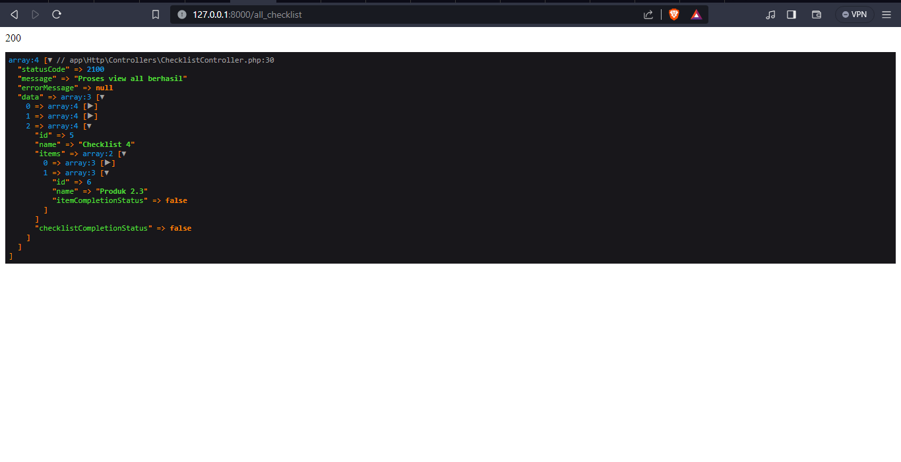

Schema DB

Request Token

Get All Checklist

Create New Checklist

Delete Checklist

Get all Checklist Item by checklist id

Create new checklist item in checklist

Get checklist item in checklist by checklist id

Update status checklist item by checklist item id

Delete item by checklist item id

Rename item by checlist item id

